# Diagrama de Flujo — Calculadora de Límites

```mermaid
flowchart TD
    %% ==================== ENTRADA ====================
    A["INICIO"] --> B["Usuario ingresa:<br/>expresión, variable,<br/>punto, dirección"]
    B --> C["app.py POST /<br/>crea LimitSolver(expr, var, point, dir)"]
    C --> D["solver.py<br/>LimitSolver.__init__()"]

    D --> D1["_parse_expr(expr_str)<br/>Normaliza símbolos<br/>Reemplaza ^ → **, [ ] → ( )<br/>SymPy sympify()"]
    D1 --> D2["_parse_point(point_str)<br/>Mapea 'oo'→∞, 'pi'→π, etc.<br/>o convierte a Rational"]
    D2 --> D3["Guarda: var, point,<br/>direction, steps=[], limit_type"]

    %% ==================== solve() ====================
    D3 --> E["LimitSolver.solve()"]

    E --> E1["_classify_expr(expr)"]
    E1 --> E1A{"¿Contiene trig?"}
    E1A -- Sí --> E1T["trigonométrico"]
    E1A -- No --> E1B{"¿Contiene log?"}
    E1B -- Sí --> E1L["logarítmico"]
    E1B -- No --> E1C{"¿Contiene exp?"}
    E1C -- Sí --> E1E["exponencial"]
    E1C -- No --> E1D{"¿Contiene sqrt/radical?"}
    E1D -- Sí --> E1R["algebraico irracional"]
    E1D -- No --> E1F{"¿Numerador y denominador<br/>son polinomios?"}
    E1F -- Sí --> E1G["algebraico racional"]
    E1F -- No --> E1H["algebraico"]

    E1G --> E2
    E1T --> E2
    E1L --> E2
    E1E --> E2
    E1R --> E2
    E1H --> E2

    %% ==================== DETECTAR FORMA ====================
    E2["_detect_form(expr)"]
    E2 --> E2A["_safe_sub() para cada argumento<br/>(sustituye x → punto)"]

    E2A --> E2B{"_safe_sub(expr)<br/>¿es NaN?"}
    E2B -- No (resultado directo) --> F["Resultado directo:<br/>mostrar sustitución<br/>→ devolver"]
    E2B -- Sí (indeterminación) --> E2C{"¿Forma?"}

    E2C -->|"0/0"| DET_0_0
    E2C -->|"∞/∞"| DET_INF_INF
    E2C -->|"∞-∞"| DET_INF_MINF
    E2C -->|"0·∞"| DET_0_INF
    E2C -->|"1^∞, 0^0, ∞^0"| DET_EXP
    E2C -->|ninguna| FALLBACK

    %% ==================== 0/0 DETALLADO ====================
    DET_0_0["0/0 → _solve_0_over_0_detailed()"]

    DET_0_0 --> PASO1_00["Paso 1:<br/>'Se sustituye la tendencia...'<br/>Muestra \\lim y sustitución"]

    PASO1_00 --> PATHS_00{"¿Tipo?"}
    PATHS_00 -->|"racional<br/>(intentar factorizar primero)"| FACTOR_00
    PATHS_00 -->|"irracional<br/>(intentar racionalizar primero)"| RAT_00

    FACTOR_00["_factor_with_info(num, den)"]
    FACTOR_00 --> FACTOR_OK{"¿Factorización<br/>elimina 0/0?"}
    FACTOR_OK -- Sí --> PASO2_FACTOR["Paso 2:<br/>'Se factoriza el numerador/denominador (tipo)'<br/>diferencia cuadrados / suma cubos / dif cubos"]
    FACTOR_OK -- No --> RAT_00

    RAT_00["_rationalize_with_info(num, den)"]
    RAT_00 --> RAT_OK{"¿Racionalización<br/>elimina 0/0?"}
    RAT_OK -- Sí --> PASO2_RAT["Paso 2:<br/>'Se racionaliza el numerador/denominador'"]
    RAT_OK -- No --> LHOPITAL_00

    PASO2_FACTOR --> PASO3_00["Paso 3:<br/>'Se sustituye... para hallar el límite'<br/>Muestra \\lim expr = sub = valor<br/>> \\boxed{resultado}"]
    PASO2_RAT --> PASO3_00
    PASO3_00 --> DEVOLVER_00["Devolver resultado"]

    LHOPITAL_00["_try_lhopital(expr)<br/>(hasta 5 iteraciones)"]
    LHOPITAL_00 --> LH_OK{"¿Resultado<br/>no indeterminado?"}
    LH_OK -- Sí --> DEVOLVER_00
    LH_OK -- No --> FALLBACK

    %% ==================== ∞/∞ DETALLADO ====================
    DET_INF_INF["∞/∞ → _solve_inf_over_inf_detailed()"]
    DET_INF_INF --> PASO1_INF["Paso 1:<br/>'Se sustituye...'<br/>Muestra \\lim (sin sustitución si ∞)"]

    PASO1_INF --> DEGREE{"_degree(num), _degree(den)<br/>¿existen y ≥ 0?"}
    DEGREE -- Sí --> DIVIDE["Paso 2:<br/>Dividir entre x^n<br/>(n = max(grado num, grado den))"]
    DIVIDE --> DIV_OK{"¿Resultado no<br/>indeterminado?"}
    DIV_OK -- Sí --> PASO3_INF["Paso 3:<br/>'Sustituimos x = ∞ en la expresión<br/>simplificada...'<br/>> \\boxed{resultado}"]
    DIV_OK -- No --> LHOPITAL_INF
    DEGREE -- No --> LHOPITAL_INF

    PASO3_INF --> DEVOLVER_INF["Devolver resultado"]

    LHOPITAL_INF["_try_lhopital(expr)"]
    LHOPITAL_INF --> LH_INF_OK{"¿Resultado<br/>no indeterminado?"}
    LH_INF_OK -- Sí --> DEVOLVER_INF
    LH_INF_OK -- No --> FALLBACK

    %% ==================== ∞-∞ DETALLADO ====================
    DET_INF_MINF["∞-∞ → _solve_inf_minus_inf_detailed()"]
    DET_INF_MINF --> PASO1_MINF["Paso 1:<br/>'Se sustituye... indeterminación'"]
    PASO1_MINF --> RADICALES{"¿Contiene sqrt?"}

    RADICALES -- Sí --> RAT_MINF["Paso 2: Racionalizar<br/>'Se racionaliza el numerador'"]
    RADICALES -- No --> RESTAR_MINF["Paso 2: Restar fracciones<br/>'Se restan fracciones'<br/>together() → combina en 1 fracción"]

    RAT_MINF --> RAT_MINF_OK{"¿Resultado<br/>no indeterminado?"}
    RAT_MINF_OK -- Sí --> PASO3_MINF["Paso 3:<br/>'Se sustituye...'<br/>> \\boxed{resultado}"]
    RAT_MINF_OK -- No --> FALLBACK_MINF

    RESTAR_MINF --> RESTAR_OK{"¿Resultado no<br/>indeterminado?"}
    RESTAR_OK -- Sí --> PASO3_MINF
    RESTAR_OK -- No --> RECLASIFICAR{"¿Nueva forma?"}
    RECLASIFICAR -->|"0/0"| SUB_00["Sub: factor / racionalizar / L'Hôpital"]
    RECLASIFICAR -->|"∞/∞"| SUB_INF["Sub: dividir por x^n / L'Hôpital"]
    SUB_00 --> PASO3_MINF
    SUB_INF --> PASO3_MINF

    PASO3_MINF --> DEVOLVER_MINF["Devolver resultado"]

    FALLBACK_MINF --> FALLBACK

    %% ==================== EXPONENCIALES ====================
    DET_EXP["1^∞, 0^0, ∞^0 → _solve_exponential_detailed()"]
    DET_EXP --> PASO1_EXP["Paso 1:<br/>'Se sustituye...'"]
    PASO1_EXP --> LN_TRANSF["Paso 2:<br/>'Se aplica logaritmo natural'<br/>L = expr → ln L = exp · ln(base)"]

    LN_TRANSF --> LN_CALC{"_safe_sub(ln_expr)<br/>¿indeterminado?"}
    LN_CALC -- No --> LN_DIRECTO["ln L = valor"]
    LN_CALC -- Sí --> LN_SILENT["_solve_silent(ln_expr)<br/>(resuelve sin guardar pasos)"]

    LN_DIRECTO --> EXP_RES["Paso 3:<br/>'Se aplica exponencial'<br/>L = e^(ln L) = resultado<br/>> \\boxed{}"]
    LN_SILENT --> LN_SILENT_OK{"¿Resultado<br/>no indeterminado?"}
    LN_SILENT_OK -- Sí --> EXP_RES
    LN_SILENT_OK -- No --> FALLBACK

    EXP_RES --> DEVOLVER_EXP["Devolver resultado"]

    %% ==================== 0·∞ ====================
    DET_0_INF["0·∞ → _solve_0_times_inf()"]
    DET_0_INF --> TRANS_0INF["Reescribir: 0/(1/∞)<br/>→ forma 0/0"]
    TRANS_0INF --> SUB_0INF_00["_solve_0_over_0_sub()<br/>o L'Hôpital"]
    SUB_0INF_00 --> DEVOLVER_0INF["Devolver resultado<br/>o fallback"]

    %% ==================== FALLBACK ====================
    FALLBACK["_solve_fallback()<br/>sympy.limit(expr, var, point, dir)"]
    FALLBACK --> DEVOLVER_FB["Devolver resultado<br/>o error"]

    %% ==================== SALIDA ====================
    F --> O["Renderizar template HTML<br/>con pasos, result_tex,<br/>form, limit_type"]
    DEVOLVER_00 --> O
    DEVOLVER_INF --> O
    DEVOLVER_MINF --> O
    DEVOLVER_EXP --> O
    DEVOLVER_0INF --> O
    DEVOLVER_FB --> O

    O --> Z["FIN"]

    %% ==================== ESTILOS ====================
    classDef process fill:#e0f2fe,stroke:#0284c7,stroke-width:2px;
    classDef decision fill:#fef3c7,stroke:#d97706,stroke-width:2px;
    classDef io fill:#f0fdf4,stroke:#16a34a,stroke-width:2px;
    classDef subprocess fill:#f3e8ff,stroke:#7e22ce,stroke-width:2px;
    classDef fallback fill:#ffe4e6,stroke:#e11d48,stroke-width:2px;

    class A,Z io;
    class B,C,D,D1,D2,D3,E,E1,E2,F,O process;
    class E1A,E1B,E1C,E1D,E1F,E2B,E2C decision;
    class PATHS_00,FACTOR_OK,RAT_OK,LH_OK decision;
    class DEGREE,DIV_OK,LH_INF_OK decision;
    class RADICALES,RAT_MINF_OK,RESTAR_OK,RECLASIFICAR decision;
    class LN_CALC,LN_SILENT_OK decision;
    class FACTOR_00,RAT_00,LHOPITAL_00 subprocess;
    class FALLBACK,FALLBACK_MINF fallback;
```

---

## Leyenda

| Forma | Color | Significado |
|-------|-------|-------------|
| Rectángulo azul | `#e0f2fe` | Proceso / acción |
| Rombo amarillo | `#fef3c7` | Decisión / bifurcación |
| Rectángulo verde | `#f0fdf4` | Inicio / Fin / Entrada-Salida |
| Rectángulo morado | `#f3e8ff` | Subproceso / función auxiliar |
| Rectángulo rojo | `#ffe4e6` | Fallback (sympy.limit) |

## Flujo principal

1. **Entrada**: El usuario completa el formulario web (expresión, variable, punto, dirección).
2. **Parseo**: Se normalizan símbolos (√ → sqrt, π → pi, ² → ^2, ∞ → oo, etc.) y se parsea con SymPy.
3. **Clasificación**: Se detecta el tipo de expresión (trigonométrico, logarítmético, exponencial, algebraico racional/irracional).
4. **Sustitución directa**: Se evalúa la expresión en el punto dado; si no es indeterminada, se devuelve el resultado inmediatamente.
5. **Detección de forma**: Se analizan las partes de la expresión para determinar la forma indeterminada (0/0, ∞/∞, ∞-∞, 0·∞, 1^∞, 0^0, ∞^0).
6. **Resolución detallada**: Se aplica el método específico para cada forma, generando pasos con descripciones textuales y LaTeX.
7. **Fallback**: Si fallan los métodos algebraicos, se usa `sympy.limit()` directamente.
8. **Salida**: Se renderiza el resultado en HTML con KaTeX, mostrando pasos, tipo de límite, forma indeterminada y resultado final en `\boxed{}`.
