# Diagrama de Flujo — Calculadora de Límites

```mermaid
flowchart TD
    %% ==================== ENTRADA ====================
    A["INICIO"] --> B["Usuario ingresa:<br/>expresión, tendencia,<br/>valor (punto)"]
    B --> C["app.py recibe POST<br/>crea LimitSolver(expr, var, point)"]

    C --> D["solver.py<br/>LimitSolver.__init__()"]

    D --> D1["_parse_expr(expr_str)<br/>Normaliza símbolos Unicode<br/>√→sqrt, π→pi, ∞→oo, ²→^2<br/>Reemplaza ^→**, [ ]→( )<br/>SymPy sympify(evaluate=False)"]
    D1 --> D2["_parse_point(point_str)<br/>Mapea 'oo'→∞, 'pi'→π, 'e'→E<br/>o convierte a Rational/Integer"]
    D2 --> D3["Guarda: var, point,<br/>steps=[], limit_type"]

    %% ==================== solve() ====================
    D3 --> E["LimitSolver.solve()"]

    E --> E1["_classify_expr(expr)"]
    E1 --> E1A{"¿Contiene e<br/>(constante de Euler)<br/>o función exp?"}
    E1A -- Sí --> E1L["logarítmico"]
    E1A -- No --> E1B{"¿Contiene ln o log?"}
    E1B -- Sí --> E1L
    E1B -- No --> E1C{"¿Contiene sin, cos,<br/>tan, cot, sec, csc?"}
    E1C -- Sí --> E1T["trigonométrico"]
    E1C -- No --> E1D{"¿Variable en el<br/>exponente de una<br/>potencia?"}
    E1D -- Sí --> E1E["exponencial"]
    E1D -- No --> E1F{"¿Contiene sqrt?"}
    E1F -- Sí --> E1R["algebraico irracional"]
    E1F -- No --> E1G{"¿Numerador y<br/>denominador son<br/>polinomios?"}
    E1G -- Sí --> E1R2["algebraico racional"]
    E1G -- No --> E1H["algebraico"]

    E1L --> E2
    E1T --> E2
    E1E --> E2
    E1R --> E2
    E1R2 --> E2
    E1H --> E2

    %% ==================== SUSTITUCIÓN DIRECTA ====================
    E2["_safe_sub(expr, point)<br/>Sustituye variable por punto<br/>y aplica sp.together()"]
    E2 --> E2B{"¿Resultado es<br/>indeterminado (nan)?"}
    E2B -- No (ej: 4) --> F["Resultado directo<br/>→ mostrar sustitución<br/>→ devolver valor"]
    E2B -- Sí (ej: 0/0) --> E2C{"_detect_form(expr)<br/>¿Qué forma tiene?"}

    %% ==================== RAMA 0/0 ====================
    E2C -->|"0/0"| DET_0_0

    DET_0_0["0/0 → _solve_0_over_0_detailed()"]
    DET_0_0 --> RUTA_TIPO{"¿limit_type?"}

    RUTA_TIPO -->|"trigonométrico"| TRIG_00
    RUTA_TIPO -->|"logarítmico"| LOG_00
    RUTA_TIPO -->|"algebraico racional"| RAC_00
    RUTA_TIPO -->|"algebraico irracional"| IRR_00

    %% --- Trigonométrico 0/0 ---
    TRIG_00["_solve_trigonometric_0_over_0()"]
    TRIG_00 --> TRIG_P1["Paso 1: Sustitución → 0/0"]
    TRIG_P1 --> TRIG_P2["Paso 2: Muestra los 3 límites<br/>trigonométricos especiales:<br/>sen(u)/u=1, u/sen(u)=1,<br/>(1-cos u)/u=0"]
    TRIG_P2 --> TRIG_P3["Paso 3: Halla el límite<br/>con _solve_silent()<br/>→ \\boxed{resultado}"]
    TRIG_P3 --> DEVOLVER_00

    %% --- Logarítmico 0/0 ---
    LOG_00["_solve_logarithmic_0_over_0()"]
    LOG_00 --> LOG_P1["Paso 1: Sustitución → 0/0"]
    LOG_P1 --> LOG_P2["Paso 2: Muestra el límite<br/>especial (e^u-1)/u=1"]
    LOG_P2 --> LOG_P3["Paso 3: Halla el límite<br/>con _solve_silent()<br/>→ \\boxed{resultado}"]
    LOG_P3 --> DEVOLVER_00

    %% --- Racional 0/0 ---
    RAC_00["Factorizar primero"]
    RAC_00 --> FACTOR_00["_factor_with_info(num, den)"]
    FACTOR_00 --> FACTOR_OK{"¿Factorización<br/>elimina 0/0?"}
    FACTOR_OK -- Sí --> RAC_P2["Paso 2: 'Se factoriza el<br/>numerador/denominador (tipo)'<br/>diferencia cuadrados /<br/>suma cubos / diferencia cubos"]
    FACTOR_OK -- No --> RAT_00["_rationalize_with_info()"]
    RAC_P2 --> RAC_P3["Paso 3: Sustituir y hallar<br/>límite → \\boxed{}"]
    RAC_P3 --> DEVOLVER_00

    %% --- Irracional 0/0 ---
    IRR_00["Racionalizar primero"]
    IRR_00 --> RAT_00
    RAT_00 --> RAT_OK{"¿Racionalización<br/>elimina 0/0?"}
    RAT_OK -- Sí --> IRR_P2["Paso 2: 'Se racionaliza el<br/>numerador/denominador'"]
    IRR_P2 --> IRR_P3["Paso 3: Sustituir y hallar<br/>límite → \\boxed{}"]
    IRR_P3 --> DEVOLVER_00
    RAT_OK -- No --> LH_00["_try_lhopital() / fallback"]

    LH_00 --> DEVOLVER_00

    DEVOLVER_00["Devolver resultado"]

    %% ==================== RAMA ∞/∞ ====================
    E2C -->|"∞/∞"| DET_INF_INF

    DET_INF_INF["∞/∞ → _solve_inf_over_inf_detailed()"]
    DET_INF_INF --> INF_P1["Paso 1: Sustitución<br/>(sin mostrar si ∞)"]
    INF_P1 --> DEGREE{"degree(num) y degree(den)<br/>¿existen?"}
    DEGREE -- Sí --> DIVIDE["Paso 2: Dividir num y den<br/>entre x^n (n = max grado)"]
    DIVIDE --> DIV_OK{"¿Resultado no<br/>indeterminado?"}
    DIV_OK -- Sí --> INF_P3["Paso 3: Sustituir x=∞<br/>→ \\boxed{resultado}"]
    DIV_OK -- No --> LH_INF["_try_lhopital()"]
    DEGREE -- No --> LH_INF
    INF_P3 --> DEVOLVER_INF
    LH_INF --> DEVOLVER_INF
    DEVOLVER_INF["Devolver resultado"]

    %% ==================== RAMA ∞-∞ ====================
    E2C -->|"∞-∞"| DET_MINF

    DET_MINF["∞-∞ → _solve_inf_minus_inf_detailed()"]
    DET_MINF --> MINF_P1["Paso 1: Sustitución → ∞-∞"]
    MINF_P1 --> RAD{"¿Contiene sqrt?"}
    RAD -- Sí --> MINF_P2R["Paso 2: Racionalizar<br/>'Se racionaliza el numerador'"]
    RAD -- No --> MINF_P2F["Paso 2: Restar fracciones<br/>together() → 1 fracción"]
    MINF_P2R --> MINF_P3["Paso 3: \\boxed{}"]
    MINF_P2F --> MINF_P3
    MINF_P3 --> DEVOLVER_MINF
    DEVOLVER_MINF["Devolver resultado"]

    %% ==================== RAMA EXPONENCIAL ====================
    E2C -->|"1^∞, 0^0, ∞^0"| DET_EXP

    DET_EXP["→ _solve_exponential_detailed(form)"]
    DET_EXP --> EXP_P1["Paso 1: Sustitución<br/>→ indeterminación"]
    EXP_P1 --> EXP_P2["Paso 2: Aplica identidad<br/>lim f^g = e^(lim (f-1)·g)<br/>Calcula (f-1)·g y simplifica"]
    EXP_P2 --> EXP_P3["Paso 3: Evalúa el límite<br/>→ e^(valor) → \\boxed{}"]
    EXP_P3 --> DEVOLVER_EXP
    DEVOLVER_EXP["Devolver resultado"]

    %% ==================== RAMA 0·∞ ====================
    E2C -->|"0·∞"| DET_0INF

    DET_0INF["0·∞ → _solve_0_times_inf()"]
    DET_0INF --> TRANS_0INF["Reescribe como 0/(1/∞)<br/>→ forma 0/0"]
    TRANS_0INF --> SUB_0INF["Sub: factor / racionalizar / L'Hôpital"]
    SUB_0INF --> DEVOLVER_0INF
    DEVOLVER_0INF["Devolver resultado"]

    %% ==================== FALLBACK ====================
    E2C -->|"ninguna"| FB
    FB["_solve_fallback()<br/>sympy.limit(expr, var, point)"]
    FB --> DEVOLVER_FB["Devolver resultado o error"]

    %% ==================== SALIDA ====================
    F --> O["Renderizar template HTML<br/>→ muestra 'límite X indeterminación Y'<br/>→ pasos con KaTeX<br/>→ resultado en \\boxed{}"]
    DEVOLVER_00 --> O
    DEVOLVER_INF --> O
    DEVOLVER_MINF --> O
    DEVOLVER_EXP --> O
    DEVOLVER_0INF --> O
    DEVOLVER_FB --> O
    O --> Z["FIN"]

    %% ==================== ESTILOS ====================
    classDef process fill:#e0f2fe,stroke:#0284c7,stroke-width:2px;
    classDef decision fill:#fef3c7,stroke:#d97706,stroke-width:2px;
    classDef io fill:#f0fdf4,stroke:#16a34a,stroke-width:2px;
    classDef subprocess fill:#f3e8ff,stroke:#7e22ce,stroke-width:2px;
    classDef fallback fill:#ffe4e6,stroke:#e11d48,stroke-width:2px;
    classDef salida fill:#ecfccb,stroke:#65a30d,stroke-width:2px;

    class A,Z io;
    class B,C,D,D1,D2,D3,E,E1,E2,F,O process;
    class E1A,E1B,E1C,E1D,E1F,E1G,E2B,E2C decision;
    class RUTA_TIPO,FACTOR_OK,RAT_OK,DEGREE,DIV_OK decision;
    class RAD,TRIG_P2,LOG_P2 decision;
    class LH_00,LH_INF,SUB_0INF subprocess;
    class FB fallback;
    class F,O,Z salida;
```

---

## Leyenda

| Figura | Color | Significado |
|--------|-------|-------------|
| Rectángulo | Azul `#e0f2fe` | Proceso / acción |
| Rombo | Amarillo `#fef3c7` | Decisión / bifurcación |
| Óvalo | Verde `#f0fdf4` | Inicio / Fin |
| Rectángulo punteado | Morado `#f3e8ff` | Subproceso auxiliar |
| Rectángulo | Rojo `#ffe4e6` | Fallback (SymPy directo) |
| Rectángulo | Verde claro `#ecfccb` | Salida / resultado |

## Flujo principal resumido

1. **Entrada**: El usuario escribe la expresión, la variable (Tendencia) y el valor del punto.
2. **Parseo**: Se convierten símbolos especiales (√, π, ∞, ², etc.) y se parsea con SymPy sin evaluar.
3. **Clasificación**: Se detecta el tipo de expresión (logarítmico si tiene `e`, trigonométrico si tiene sen/cos, exponencial si la variable está en un exponente, algebraico racional/irracional).
4. **Sustitución directa**: Se evalúa en el punto. Si no es indeterminado, se devuelve el resultado inmediato.
5. **Detección de forma**: Se identifica la forma indeterminada (0/0, ∞/∞, ∞-∞, 1^∞, etc.).
6. **Resolución por método específico** (3 pasos cada uno):
   - **0/0 algebraico racional** → factorizar (mostrando el caso: diferencia de cuadrados, suma/diferencia de cubos)
   - **0/0 algebraico irracional** → racionalizar
   - **0/0 trigonométrico** → límites especiales sen(u)/u, u/sen(u), (1-cos u)/u
   - **0/0 logarítmico** → límite especial (e^u-1)/u
   - **∞/∞** → dividir por máxima potencia
   - **∞-∞** → racionalizar o combinar fracciones
   - **1^∞, 0^0, ∞^0** → identidad lim f^g = e^(lim (f-1)·g)
   - **0·∞** → convertir a 0/0
7. **Fallback**: Si los métodos algebraicos fallan, se usa `sympy.limit()` directamente.
8. **Salida**: Se muestra el resultado en HTML con KaTeX: "límite [tipo] indeterminación [forma]" y los 3 pasos.
